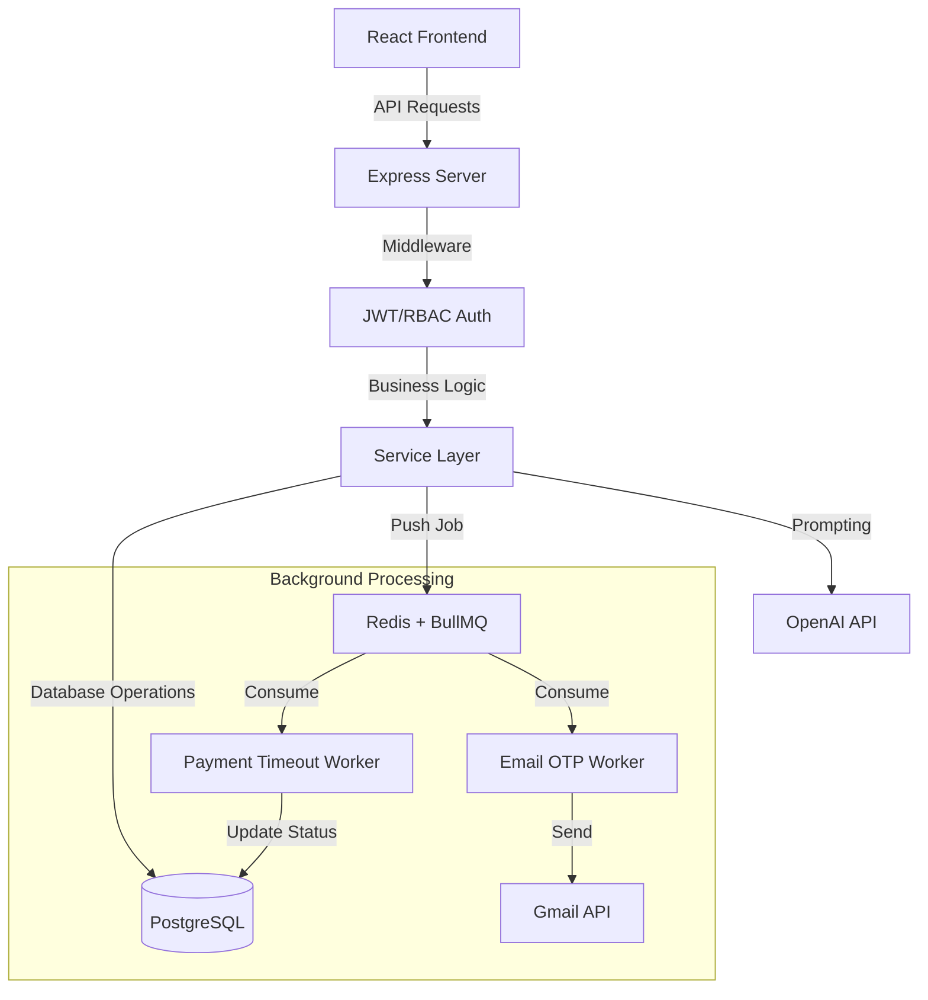

# 🚀 VietTravel Pro - Hệ Thống Quản Lý Du Lịch Toàn Diện (Full-stack Ecosystem)

<p align="center">
  
  
  
  
  
</p>

## Description
**VietTravel Pro** là một nền tảng quản lý du lịch hiện đại, được thiết kế để số hóa toàn bộ quy trình trải nghiệm du lịch. Dự án không chỉ dừng lại ở một trang web đặt tour thông thường mà là một hệ thống phân quyền đa vai trò (Customer - Owner - Admin) với khả năng xử lý các tác vụ phức tạp như quản lý dịch vụ, thanh toán trực tuyến (Momo/Webhook), và đặc biệt là tích hợp **Generative AI (GPT-4)** để tự động hóa việc lập kế hoạch lịch trình.

---

## Demo / Screenshots
*(Dưới đây là mô tả các màn hình chính, bạn hãy thay link ảnh thực tế vào nhé)*

|  |  |
|:---:|:---:|
| **Trang chủ & Tìm kiếm Tour** | **Lập kế hoạch lịch trình bằng AI** |
|  |  |
| **Bảng điều khiển cho Chủ dịch vụ** | **Giao diện đặt chỗ trên Mobile** |

---

## Problem Statement
Trong các hệ thống đặt chỗ du lịch hiện nay, các vấn đề phổ biến bao gồm:
1. **Mất an toàn dữ liệu khi thanh toán chậm:** Các đơn hàng "treo" làm chiếm dụng chỗ/voucher vô ích.
2. **Trải nghiệm người dùng kém khi lập kế hoạch:** Người dùng mất quá nhiều thời gian để tự lên lịch trình.
3. **Quản lý Inventory phức tạp:** Việc cấp phát và thu hồi voucher/phòng/chỗ ngồi thường xảy ra xung đột khi có lượng truy cập cao.

**VietTravel Pro** giải quyết bằng cách triển khai **Queue-based Background Workers** để tự động thu hồi tài nguyên và sử dụng **LLM (Large Language Model)** để hỗ trợ tư vấn tức thì.

---

## Features

### Customer (Khách du lịch)
- **AI-Powered Itinerary:** Nhập ngân sách & sở thích để AI (OpenAI) sinh ra lịch trình chi tiết (ngày/giờ/địa điểm).
- **Multi-Service Booking:** Đặt tour trọn gói, phòng khách sạn, vé xe khách chỉ trên một nền tảng.
- **Seat/Room Selection:** Chọn vị trí ghế ngồi (Bus) hoặc loại phòng (Hotel) theo thời gian thực.
- **Payment Integration:** Hỗ trợ thanh toán qua mã QR Momo và hệ thống Webhook tự động xác nhận đơn hàng.
- **OTP Verification:** Đăng ký tài khoản an toàn với mã xác verify gửi qua Email.

### Provider (Chủ cơ sở dịch vụ)
- **Provider Dashboard:** Quản lý doanh thu, thống kê đơn hàng và biểu đồ tăng trưởng.
- **Inventory Control:** Hệ thống quản lý Voucher thông minh, tự động trừ/hoàn khi có giao dịch.
- **Flexible Management:** Tùy chỉnh dịch vụ (Tour/Hotel/Bus) với bộ lọc trạng thái Active/Inactive.

### Admin (Quản trị viên)
- **Role-Based Access Control (RBAC):** Phân quyền chặt chẽ giữa Admin, Owner và Customer.
- **Geography Master Data:** Bộ công cụ quản lý dữ liệu vùng miền (Quốc gia/Tỉnh/Khu vực) với khả năng Crawl dữ liệu tự động.
- **System Logs:** Giám sát sức khỏe hệ thống và trạng thái các Worker.

---

## Tech Stack
- **Backend:** Node.js (Express), TypeScript (Strict Typing), `express-validator`.
- **Database:** PostgreSQL (Relation DB), `pg` library, tối ưu hóa với Indexes.
- **Messaging & Cache:** Redis, **BullMQ** (Xử lý hàng đợi thanh toán/email).
- **Security:** Passport/JWT, Bcrypt (Hash Password), Google OAuth 2.0.
- **Notification:** BullMQ Workers + Gmail Service.
- **Frontend:** React 18, Vite, TailwindCSS, Shadcn UI, TanStack Query.
- **External APIs:** OpenAI (GPT-4), Map Leaflet, Momo Payment.

---

## Architecture
Dự án kiến trúc theo mô hình **Controller-Service-Manager/Worker** giúp tách biệt logic nghiệp vụ:



---

## Project Structure
```text
├── backend/
│   ├── src/
│   │   ├── controllers/      # Tiếp nhận Request, điều phối Logic
│   │   ├── services/         # Chứa Business Logic chính (Voucher, Booking)
│   │   ├── workers/          # Background Jobs (Xử lý logic chạy ngầm)
│   │   ├── routes/           # Định nghĩa Endpoint (Auth, Customer, Owner)
│   │   ├── middleware/       # Kiểm tra Auth, phân quyền, catch error
│   │   ├── utils/            # Upload file, Token, Helper functions
│   │   └── index.ts          # Entry point, khởi tạo Server & Workers
│   ├── database/             # SQL Schema, Triggers & Migrations
│   └── scripts/              # Crawl dữ liệu địa lý tự động
└── Frontend/                 # React source code với Vite
```

---

## Installation

1. **Clone & Setup:**
   ```bash
   git clone https://github.com/ngoctien1712/travel-manager-pro.git
   cd travel-manager-pro
   npm install
   ```
2. **Database Migration:**
   ```bash
   cd backend
   # Tạo database 'travel_manager' sau đó chạy:
   npm run db:migrate # Chạy schema.sql
   ```
3. **Environment:** Coppy `.env.example` thành `.env` và điền các API Key.
4. **Start Application:**
   ```bash
   # Chạy cả Frontend và Backend (ở root)
   npm run dev
   ```

---

## Environment Variables
Các biến quan trọng cần thiết để dự án vận hành:
- `DATABASE_URL`: Kết nối PostgreSQL.
- `REDIS_URL`: Địa chỉ server Redis cho BullMQ.
- `OPENAI_API_KEY`: Key từ OpenAI để sử dụng tính năng AI Planner.
- `FRONTEND_URL`: Để cấu hình CORS (Mặc định `http://localhost:8080`).

---

## API Documentation
Một số API tiêu biểu (Đã được test qua Postman):

| Method | Endpoint | Description | Role |
|:---:|:---|:---|:---:|
| `POST` | `/api/auth/register` | Đăng ký tài khoản mới | Public |
| `POST` | `/api/planning/generate` | Sinh lịch trình du lịch bằng AI | Customer |
| `POST` | `/api/customer/bookings` | Tạo đơn hàng mới (Tour/Hotel/Bus) | Customer |
| `GET` | `/api/owner/orders` | Danh sách đơn hàng cần xử lý | Owner |
| `PUT` | `/api/owner/vouchers/:id` | Cập nhật kho voucher | Owner |
| `GET` | `/api/admin/geography/cities`| Quản lý dữ liệu địa lý | Admin |

---

## Future Improvements
- [ ] **Mobile App:** Build phiên bản Mobile hoàn chỉnh bằng React Native.
- [ ] **Elasticsearch:** Tích hợp bộ tìm kiếm nâng cao cho hàng triệu tour.
- [ ] **Dockerize:** Đóng gói toàn bộ hệ thống bằng Docker & Kubernetes.
- [ ] **Unit Testing:** Triển khai bộ test toàn diện với Vitest/Supertest.

---

## Author
**[Tên Của Bạn]** - Backend Intern Developer
- **Email:** [Email Của Bạn]
- **LinkedIn:** [Link LinkedIn Của Bạn]
- **Portfolio:** [Link Portfolio Của Bạn]
- **Github:** [ngoctien1712](https://github.com/ngoctien1712)

---
