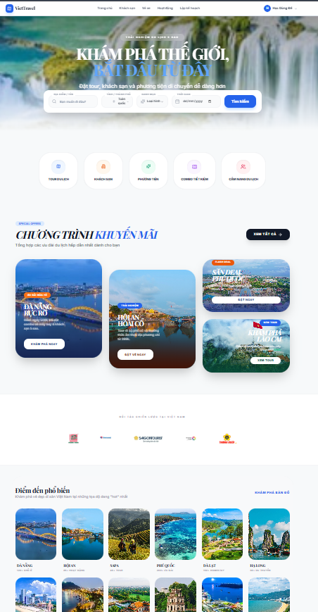
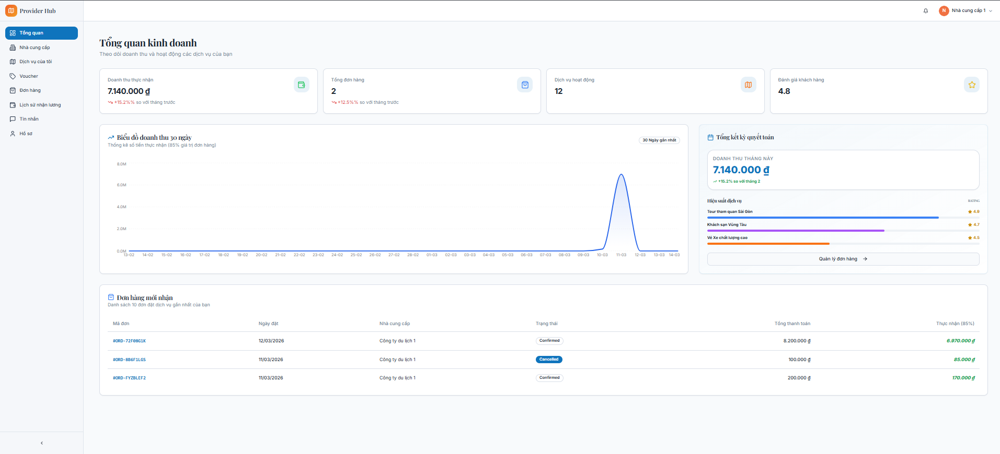
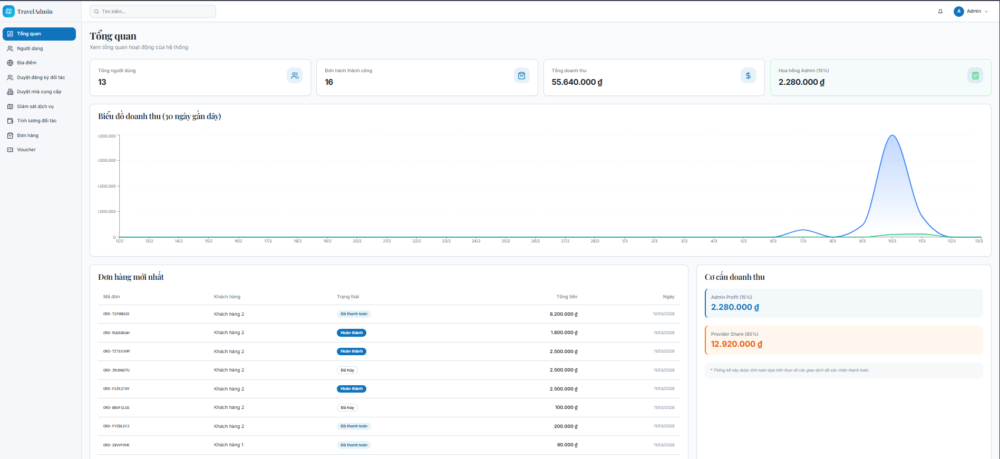
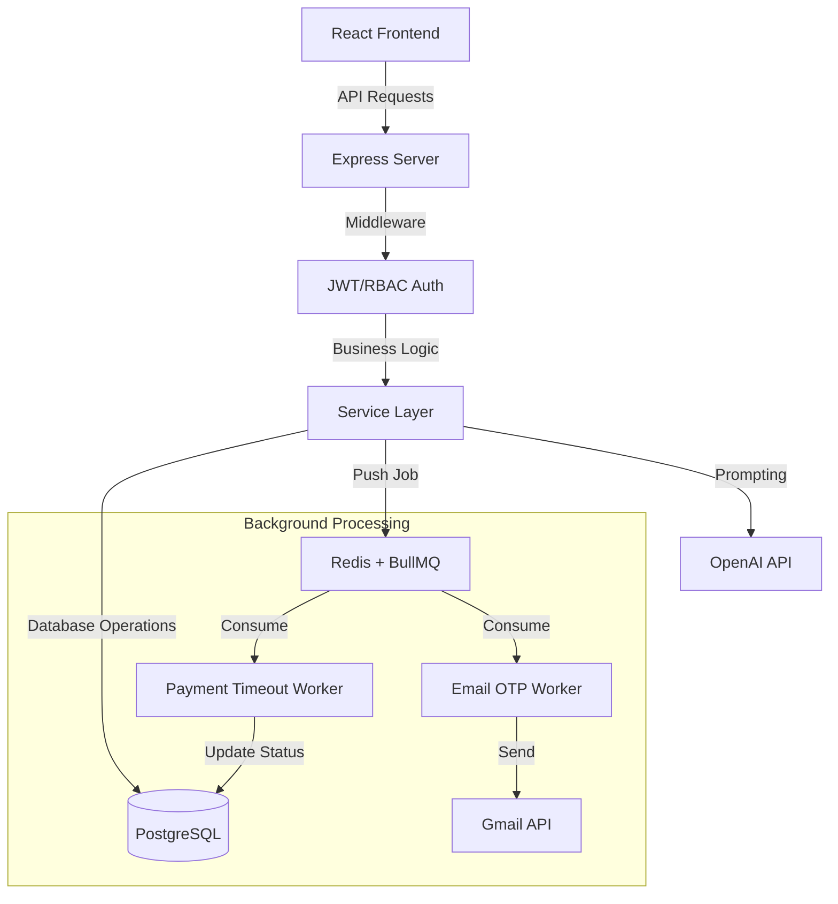

# TripMana Pro - Multi-Service Travel Booking E-commerce Platform

<p align="center">
  
  
  
  
  
</p>

## Description
**TripMana Pro** is a modern travel management platform designed to digitize the entire travel experience. The project is not just a typical tour booking website, but a multi-role authorization system (Customer - Owner - Admin) capable of handling complex tasks such as service management, online payments (Momo/Webhook), and specifically integrating **Generative AI (GPT-4)** to automate itinerary planning.

---

## Demo / Screenshots

|  | 
| **Home Page & Tour Search** | 
|  | 
| **Hotel Services Page** |
|  | 
| **Bus Services Page** | 
|  | 
| **Tour Services Page** |
|  | 
| **Owner Dashboard** |
|  | 
| **Admin Dashboard** |

---

## Problem Statement
In current travel booking systems, common issues include:
1. **Data inconsistency during delayed payments:** "Pending" orders occupy slots/vouchers pointlessly.
2. **Poor user experience in planning:** Users spend too much time manually planning their itineraries.
3. **Complex Inventory Management:** Allocating and revoking vouchers/rooms/seats often leads to conflicts under high traffic.

**TripMana Pro** solves this by implementing **Queue-based Background Workers** to automatically revoke resources and utilizing **LLM (Large Language Model)** for instant itinerary consultation.

---

## Features

### Customer
- **AI-Powered Itinerary:** Input budget & preferences to let AI (OpenAI) generate a detailed itinerary (date/time/location).
- **Multi-Service Booking:** Book package tours, hotel rooms, and bus tickets all on a single platform.
- **Seat/Room Selection:** Select bus seats or hotel room types in real-time.
- **Payment Integration:** Supports Momo QR code payments and an automated Webhook system for order confirmation.
- **OTP Verification:** Secure account registration with email OTP verification.

### Provider (Service Owner)
- **Provider Dashboard:** Manage revenue, order statistics, and growth charts.
- **Inventory Control:** Smart voucher management system that automatically deducts/refunds upon transactions.
- **Flexible Management:** Customize services (Tour/Hotel/Bus) with Active/Inactive status filters.

### Admin
- **Role-Based Access Control (RBAC):** Strict authorization between Admin, Owner, and Customer.
- **Geography Master Data:** Tools to manage geographical data (Countries/Provinces/Areas) with automated web crawling capabilities.
- **System Logs:** Monitor system health and worker statuses.

---

## Tech Stack
- **Backend:** Node.js (Express), TypeScript (Strict Typing), `express-validator`.
- **Database:** PostgreSQL (Relational DB), `pg` library, optimized with Indexes.
- **Messaging & Cache:** Redis, **BullMQ** (Handling payment/email queues).
- **Security:** Passport/JWT, Bcrypt (Hash Password), Google OAuth 2.0.
- **Notification:** BullMQ Workers + Gmail Service.
- **Frontend:** React 18, Vite, TailwindCSS, Shadcn UI, TanStack Query.
- **External APIs:** OpenAI (GPT-4), Map Leaflet, Momo Payment.

---

## Architecture
The project follows a **Controller-Service-Manager/Worker** architecture to separate business logic:



---

## Project Structure
```text
├── backend/
│   ├── src/
│   │   ├── controllers/      # Handles Requests, coordinates logic
│   │   ├── services/         # Core business logic (Voucher, Booking)
│   │   ├── workers/          # Background Jobs (Background processing logic)
│   │   ├── routes/           # Endpoint definitions (Auth, Customer, Owner)
│   │   ├── middleware/       # Auth checking, RBAC, error catching
│   │   ├── utils/            # File upload, Token, Helper functions
│   │   └── index.ts          # Entry point, initializes Server & Workers
│   ├── database/             # SQL Schema, Triggers & Migrations
│   └── scripts/              # Automated geographical data crawler
└── Frontend/                 # React source code with Vite
```

---

## Installation

1. **Clone & Setup:**
   ```bash
   git clone https://github.com/ngoctien1712/travel-manager-pro.git
   cd travel-manager-pro
   npm install
   ```
2. **Database Migration:**
   ```bash
   cd backend
   # Create database 'travel_manager' then run:
   npm run db:migrate # Execute schema.sql
   ```
3. **Environment:** Copy `.env.example` to `.env` and fill in the API Keys.
4. **Start Application:**
   ```bash
   # Run both Frontend and Backend (at root)
   npm run dev
   ```

---

## Environment Variables
Important variables required to run the project:
- `DATABASE_URL`: PostgreSQL connection string.
- `REDIS_URL`: Redis server address for BullMQ.
- `OPENAI_API_KEY`: Key from OpenAI to use the AI Planner feature.
- `FRONTEND_URL`: For CORS configuration (Default `http://localhost:8080`).

---

## API Documentation
Some key APIs (Tested via Postman):

| Method | Endpoint | Description | Role |
|:---:|:---|:---|:---:|
| `POST` | `/api/auth/register` | Register a new account | Public |
| `POST` | `/api/planning/generate` | Generate travel itinerary using AI | Customer |
| `POST` | `/api/customer/bookings` | Create new booking (Tour/Hotel/Bus) | Customer |
| `GET` | `/api/owner/orders` | List of orders pending process | Owner |
| `PUT` | `/api/owner/vouchers/:id` | Update voucher inventory | Owner |
| `GET` | `/api/admin/geography/cities`| Manage geographical data | Admin |

---

## Future Improvements
- [ ] **Mobile App:** Build a fully functional mobile version using React Native.
- [ ] **Elasticsearch:** Integrate advanced search engine for millions of tours.
- [ ] **Dockerize:** Containerize the entire system using Docker & Kubernetes.
- [ ] **Unit Testing:** Implement automated test suites using Vitest/Supertest.

---

## Authors

**1. Tran Phuc Thanh** - Backend Developer (Core)
- **Email:** [tranphucthanh2002@gmail.com]
- **LinkedIn:** [www.linkedin.com/in/phúc-thành-trần-a01711355]
- **Github:** [https://github.com/phucthanh1705]

**2. Huynh Ngoc Tien** - Backend Developer
- **Email:** [huynhngoctien1712@gmail.com]
- **LinkedIn:** [https://www.linkedin.com/in/ngoctien1712/]
- **Github:** [https://github.com/ngoctien1712]

---
