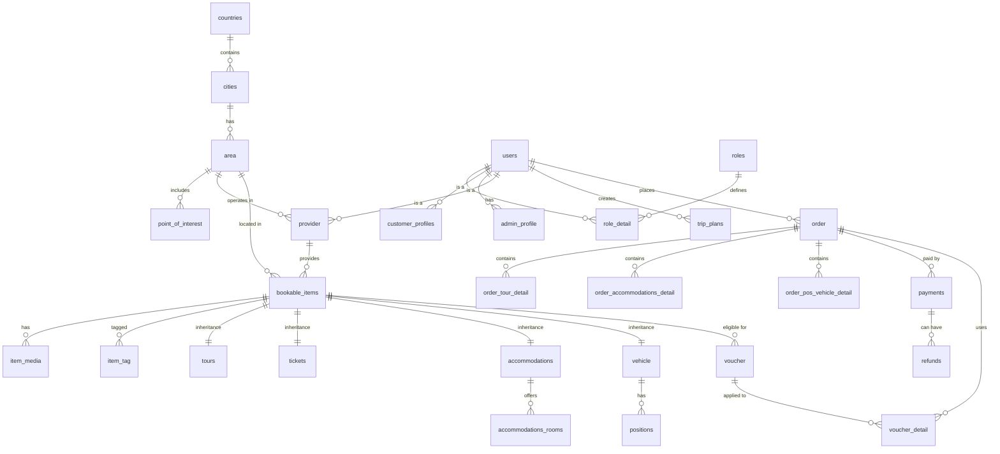

# Đặc tả Cơ sở dữ liệu Dự án Travel Manager Pro

Tài liệu này cung cấp cái nhìn chi tiết về cấu trúc cơ sở dữ liệu của dự án **VietTravel**, dựa trên hệ quản trị cơ sở dữ liệu PostgreSQL.

## 1. Tổng quan các nhóm bảng
Hệ thống được chia thành 7 nhóm chức năng chính:
- **Địa lý (Geography):** Quản lý quốc gia, thành phố và các khu vực du lịch.
- **Người dùng & Phân quyền (Users & Roles):** Quản lý tài khoản, vai trò và hồ sơ khách hàng/admin/nhà cung cấp.
- **Dịch vụ có thể đặt (Bookable Items):** Các dịch vụ chung như Tour, Vé, Chỗ ở, Phương tiện.
- **Loại hình dịch vụ cụ thể (Specific Item Types):** Chi tiết riêng biệt cho từng loại dịch vụ.
- **Đơn hàng (Orders):** Quản lý giao dịch và chi tiết đơn hàng của khách hàng.
- **Khuyến mãi (Vouchers):** Quản lý mã giảm giá và áp dụng cho đơn hàng.
- **Thanh toán (Payments):** Theo dõi lịch sử thanh toán và hoàn tiền.

---

## 2. Chi tiết các bảng

### Nhóm Địa lý
| Tên bảng | Mô tả | Các trường chính |
| :--- | :--- | :--- |
| `countries` | Danh sách quốc gia | `id_country`, `code`, `name`, `name_vi` |
| `cities` | Danh sách thành phố thuộc quốc gia | `id_city`, `id_country` (FK), `name`, `latitude`, `longitude` |
| `area` | Khu vực du lịch cụ thể | `id_area`, `id_city` (FK), `name`, `status` |
| `point_of_interest` | Các điểm tham quan nổi bật | `id_poi`, `id_area` (FK), `name`, `poi_type` |

### Nhóm Người dùng & Phân quyền
| Tên bảng | Mô tả | Các trường chính |
| :--- | :--- | :--- |
| `users` | Thông tin tài khoản đăng nhập | `id_user`, `email`, `password_hash`, `status` |
| `roles` | Các vai trò trong hệ thống (ADMIN, CUSTOMER...) | `id_role`, `code` |
| `role_detail` | Bảng trung gian gán vai trò cho người dùng | `id_role` (FK), `id_user` (FK) |
| `customer_profiles` | Thông tin bổ sung cho Khách hàng | `id_user` (FK), `date`, `travel_style` |
| `provider` | Thông tin Nhà cung cấp dịch vụ | `id_provider`, `id_user` (FK), `id_area` (FK), `name`, `status` |

### Nhóm Dịch vụ (Bookable Items)
| Tên bảng | Mô tả | Các trường chính |
| :--- | :--- | :--- |
| `bookable_items` | Bảng cha chứa thông tin chung của mọi dịch vụ | `id_item`, `item_type` (tour/ticket...), `price`, `status` |
| `item_media` | Hình ảnh/Video cho dịch vụ | `id_media`, `url`, `id_item` (FK) |
| `item_tag` | Các nhãn từ khóa cho dịch vụ | `tag`, `id_item` (FK) |

### Nhóm Chi tiết Dịch vụ
| Tên bảng | Mô tả | Các trường chính |
| :--- | :--- | :--- |
| `tours` | Chi tiết về Tour du lịch | `id_item` (FK), `start_at`, `end_at`, `max_slots` |
| `accommodations` | Thông tin khách sạn/chỗ ở | `id_item` (FK), `address` |
| `accommodations_rooms` | Các loại phòng trong khách sạn | `id_room`, `id_item` (FK), `name_room`, `max_guest`, `price` |
| `vehicle` | Thông tin phương tiện di chuyển | `id_vehicle`, `id_item` (FK), `code_vehicle`, `max_guest` |
| `positions` | Chỗ ngồi/Vị trí cụ thể trên phương tiện | `id_position`, `id_vehicle` (FK), `price` |

### Nhóm Đơn hàng & Thanh toán
| Tên bảng | Mô tả | Các trường chính |
| :--- | :--- | :--- |
| `order` | Thông tin tổng quát đơn hàng | `id_order`, `order_code`, `total_amount`, `id_user` (FK) |
| `payments` | Thông tin giao dịch thanh toán | `id_pay`, `id_order` (FK), `amount`, `status`, `method` |
| `refunds` | Thông tin hoàn tiền | `id_refund`, `id_pay` (FK), `amount`, `reason_code` |

---

## 3. Mã Mermaid (Dùng để vẽ trực tiếp)

Bạn có thể sao chép đoạn mã này vào [Mermaid Live Editor](https://mermaid.live/) để xem sơ đồ:



---

## 4. Mã DBML (Dòng mã chuyên nghiệp cho dbdiagram.io)

Công cụ tốt nhất để vẽ CSDL đẹp và chuyên nghiệp là [dbdiagram.io](https://dbdiagram.io/). Hãy dán đoạn mã sau vào đó:

```dbml
// Nhóm Địa lý
Table countries {
  id_country uuid [pk]
  code varchar
  name varchar
  name_vi varchar
}

Table cities {
  id_city uuid [pk]
  id_country uuid [ref: > countries.id_country]
  name varchar
  name_vi varchar
  latitude decimal
  longitude decimal
}

Table area {
  id_area uuid [pk]
  id_city uuid [ref: > cities.id_city]
  name varchar
  attribute jsonb
  status varchar
}

Table point_of_interest {
  id_poi uuid [pk]
  id_area uuid [ref: > area.id_area]
  name varchar
  poi_type jsonb
}

// Nhóm Người dùng
Table users {
  id_user uuid [pk]
  email varchar [unique]
  phone varchar
  full_name varchar
  password_hash varchar
  status varchar
  created_at timestamptz
}

Table roles {
  id_role uuid [pk]
  code varchar [unique]
}

Table role_detail {
  id_role uuid [pk, ref: > roles.id_role]
  id_user uuid [pk, ref: > users.id_user]
}

Table customer_profiles {
  id_user uuid [pk, ref: > users.id_user]
  date date
  travel_style varchar
}

Table provider {
  id_provider uuid [pk]
  id_user uuid [ref: > users.id_user]
  id_area uuid [ref: > area.id_area]
  name varchar
  status varchar
}

// Nhóm Dịch vụ
Table bookable_items {
  id_item uuid [pk]
  id_provider uuid [ref: > provider.id_provider]
  id_area uuid [ref: > area.id_area]
  item_type varchar
  title varchar
  price decimal
  status varchar
}

Table tours {
  id_item uuid [pk, ref: - bookable_items.id_item]
  start_at timestamptz
  end_at timestamptz
  max_slots integer
}

Table accommodations {
  id_item uuid [pk, ref: - bookable_items.id_item]
  address text
}

Table accommodations_rooms {
  id_room uuid [pk]
  id_item uuid [ref: > accommodations.id_item]
  name_room varchar
  price decimal
}

// Nhóm Đơn hàng
Table order {
  id_order uuid [pk]
  order_code varchar [unique]
  total_amount decimal
  status varchar
  id_user uuid [ref: > users.id_user]
}

Table payments {
  id_pay uuid [pk]
  id_order uuid [ref: > order.id_order]
  status varchar
  amount decimal
  method varchar
}
```

---

## 5. Gợi ý công cụ hỗ trợ vẽ CSDL

Dựa trên nhu cầu của bạn, đây là các công cụ tốt nhất để vẽ CSDL:

1.  **dbdiagram.io (Khuyên dùng):** 
    *   **Ưu điểm:** Cực kỳ chuyên nghiệp, giao diện đẹp, dùng mã DBML (như tôi đã cung cấp ở mục 4) để tự động tạo sơ đồ.
    *   **Cách dùng:** Truy cập trang web, xóa nội dung mặc định bên trái và dán mã DBML của tôi vào.
2.  **Mermaid.live:**
    *   **Ưu điểm:** Nhanh gọn, có thể tích hợp trực tiếp vào các file Markdown (như GitHub/GitLab).
    *   **Cách dùng:** Dán mã Mermaid ở mục 3 vào trang [mermaid.live](https://mermaid.live/).
3.  **DBeaver / MySQL Workbench:**
    *   **Ưu điểm:** Nếu bạn đã cài đặt database thực tế, các công cụ này có tính năng "Reverse Engineer" để tự động vẽ sơ đồ từ các bảng có sẵn một cách chính xác nhất.
    *   **Cách dùng:** Kết nối tới DB PostgreSQL của bạn -> Chuột phải vào Database/Schema -> Chọn "View Diagram" hoặc "ER Diagram".
